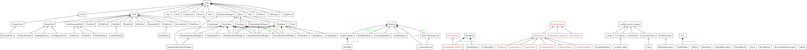

<!-- brew install node -->
<!-- npm install -g reveal-md -->
<!-- reveal-md -->

#阅读代码

*  发现新的结构、库，及其用法
*  学习如何合理组织代码
*  解决问题的思路
*  信心--知道自己是对的
*  认真读我们用到的那些库

---

#ORM

* Object Relational Mapping
* 对查询的封装
* 对返回结果的构建

---

# `peewee的作者`

* Charles Leifer
* http://charlesleifer.com/blog/
* https://readthedocs.com/

---

#整体结构

* 2*3=6
* 以node为首的一堆用于构建查询的类
* 围绕在Model周围的类
* 实现具体数据库的，以Datebase为首的
* 有图！！

---

#实际的例子

* 我们使用peewee的时候首先要定义model，
* 声明式语法（Declarative syntax），类django
* 你说是啥就是啥你说有啥就有啥。

    from peewee import *

    db = SqliteDatabase('people.db')

    class Person(Model):
        name = CharField()
        birthday = DateField()
        is_relative = BooleanField()
        class Meta:
            database = db # This model uses the "people.db" database.
    #db.connect()
    #db.create_tables([Person])

---

##  `__new__` 和`__init__`

* 类创建的时候，一定会执行这两个方法一次
* 先执行的是`__new__`,后执行`__init__`

    # Python 2/3 compatibility helpers. These helpers are used internally and are
    # not exported.
    def with_metaclass(meta, base=object):
        return meta("NewBase", (base,), {})

* [这个是链接](https://github.com/softside/peewee/blob/280/peewee.py#L4146)

---

# 回答几个问题

* 执行`db.create_tables`,表名是如何确定的
* 默认的叫id的主键是如何生成的
* 如何创建索引

---

#链式查询的实现

链式查询的应用场景还是很多的

    @classmethod
    def select(cls, *selection):
        query = SelectQuery(cls, *selection)
        if cls._meta.order_by:
            query = query.order_by(*cls._meta.order_by)
        return query

    def returns_clone(func):
    """
    Method decorator that will "clone" the object before applying the given
    method.  This ensures that state is mutated in a more predictable fashion,
    and promotes the use of method-chaining.
    """
        def inner(self, *args, **kwargs):
            clone = self.clone()  # Assumes object implements `clone`.
            func(clone, *args, **kwargs)
            return clone
        inner.call_local = func  # Provide a way to call without cloning.
        return inner

---

各个模块之间是如何发生关系的

    db.create_tables([Person])

    def create_tables(self, models, safe=False):
        create_model_tables(models, fail_silently=safe)

    def create_model_tables(models, **create_table_kwargs):
        """Create tables for all given models (in the right order)."""
        for m in sort_models_topologically(models):
            m.create_table(**create_table_kwargs)

    @classmethod
    def create_table(cls, fail_silently=False):
        if fail_silently and cls.table_exists():
            return

        db = cls._meta.database
        pk = cls._meta.primary_key
        if db.sequences and pk.sequence:
            if not db.sequence_exists(pk.sequence):
                db.create_sequence(pk.sequence)

        db.create_table(cls)
        cls._create_indexes()
